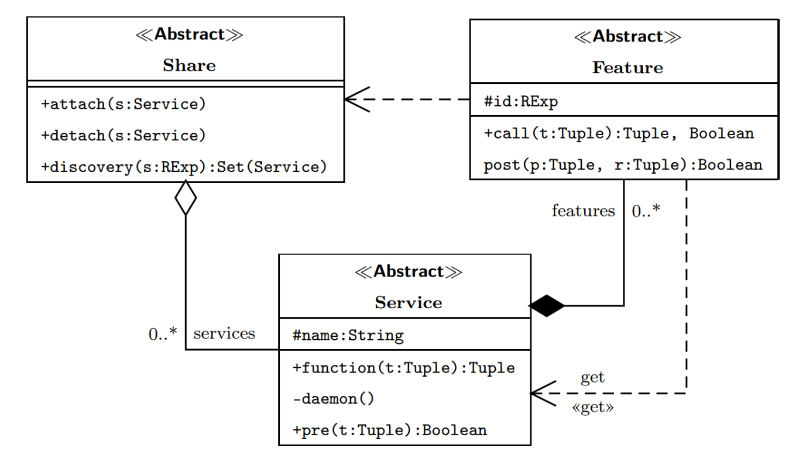

Pattern
=========

The design pattern **Share** is made up of three classes: 

- Share
- Service
- Feature 

**Share** manages the common space for sharing services and services
with **Feature** the implementation of the service. 

Each service **must** subscribe to at least one sharing service provider to allow others to use the
service.

Description
-------------

The share pattern is a **metaprogramming pattern** [1]_ since some parts
of the service are known only at the time of execution and depend on the state
of the system

The definition of a service requires the coding of a function
``function`` and its ``daemon`` resident component, if any. A ``pre`` predicate specifies the 
preconditions for function. 

A string attribute identifies service in a unique world. For example an **SNMP MIB** can be
used to identify a service. 

.. note::
   A management information base **(MIB)** is a database used for managing the 
   entities in a communication network. Most often associated with the 
   Simple Network Management Protocol **(SNMP)**, the term is also used more 
   generically in contexts such as in OSI/ISO Network management model. 
   

In ``function`` coding there may be calls to external services that are specified by implementations of
**Feature**. The ``id`` attribute defines a regular expression that describes semantically the service requested. The invocation of a service within ``function``
occurs through the call invocation relating to a specification present in features. 

The ``call`` operation invokes discovery with an id attribute to identify everyone
the services subscribed to **Share** to which the calling service is subscribed. If he comes
produced a non-null set of services, the next phase of invocation of services. 

The primitive ``get`` is used for this phase get code from a service

Sequence Diagram
------------------

.. [1] *Metaprogramming is a programming technique in which computer programs have the ability to treat other programs as their data. It means that a program can be designed to read, generate, analyze or transform other programs, and even modify itself while running. In some cases, this allows programmers to minimize the number of lines of code to express a solution, in turn reducing development time.*